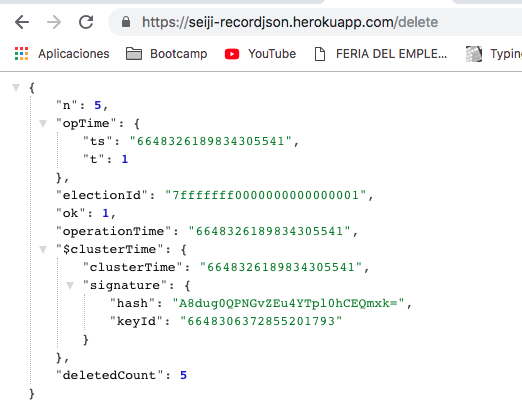
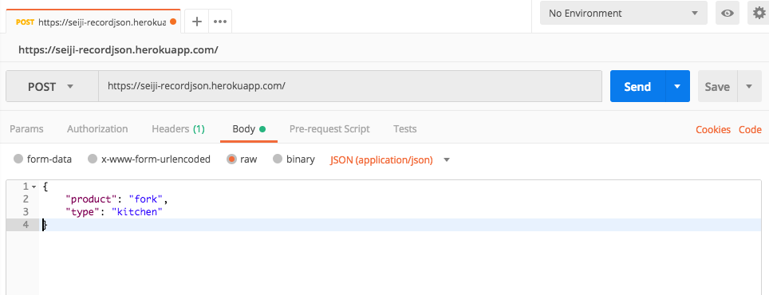
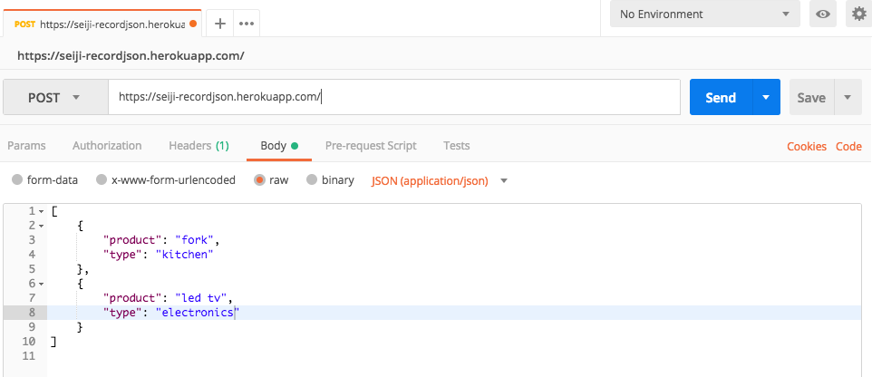

# recordjsonEndpoint

A server that captures json objects via post and save them in mongodb


# Deployed App

[https://seiji-recordjson.herokuapp.com/](https://seiji-recordjson.herokuapp.com/)

## Show Objects

[https://seiji-recordjson.herokuapp.com/](https://seiji-recordjson.herokuapp.com/)

## Delete Objects

[https://seiji-recordjson.herokuapp.com/delete](https://seiji-recordjson.herokuapp.com/delete)



## Add Objects with POST

POST [https://seiji-recordjson.herokuapp.com/](https://seiji-recordjson.herokuapp.com/)

## POSTMAN Send One Object


```javascript
{
	"product": "fork",
	"type": "kitchen"
}
```
## POSTMAN Send Multiple Objects



```javascript
[
	{
		"product": "fork",
		"type": "kitchen"
	},
	{
		"product": "led tv",
		"type": "electronics"
	}
]
```